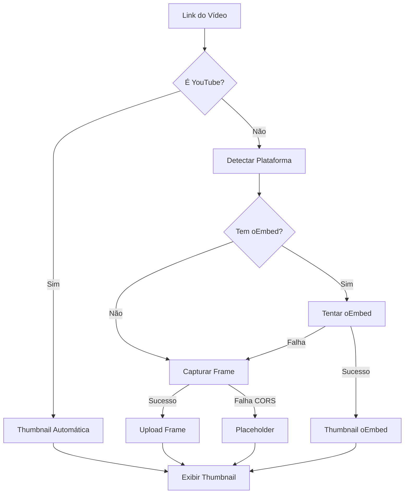

# Sistema de Capas para Aulas Gravadas

Este documento descreve o sistema de capas para aulas que prioriza thumbnails de vídeos como imagem principal.

## Prioridade de Capas

O sistema segue a seguinte ordem de prioridade para exibir a capa de uma aula:

1. **Thumbnail do vídeo** (`video_thumbnail_url`) - PRIMÁRIA
2. **Capinha manual** (`cover_file_path` ou `cover_url`) - SECUNDÁRIA  
3. **Placeholder** (`/placeholders/aula-cover.png`) - FALLBACK

## Plataformas Suportadas

### YouTube
- ✅ **Detecção automática**: Funciona imediatamente
- ✅ **Thumbnail**: Extraído automaticamente via `i.ytimg.com`
- ✅ **Formatos**: `youtu.be/`, `youtube.com/watch?v=`, `youtube.com/shorts/`, `youtube.com/embed/`

### Vimeo  
- ✅ **Detecção automática**: Funciona
- ✅ **Thumbnail**: Captura automática de frame do vídeo
- ✅ **Fallback**: oEmbed via edge function se frame capture falhar

### Instagram
- ✅ **Detecção automática**: Funciona  
- ✅ **Thumbnail**: Captura automática de frame do vídeo
- ✅ **Fallback**: oEmbed via edge function se frame capture falhar

### Outros vídeos
- ⚠️ **Detecção**: Tenta detectar como vídeo genérico
- ✅ **Thumbnail**: Tentativa de captura de frame
- ⚠️ **Limitação**: Pode falhar devido a políticas CORS

## Estrutura do Banco

### Novas colunas na tabela `aulas`:

```sql
video_url_original text,        -- URL original do vídeo
platform text,                 -- 'youtube', 'vimeo', 'instagram', 'arquivo'
video_id text,                  -- ID extraído da URL
embed_url text,                 -- URL para embed do vídeo
video_thumbnail_url text,       -- Thumbnail do vídeo (usado como 1ª opção)
cover_source text,              -- 'upload' ou 'url'
cover_file_path text,           -- Caminho no storage
cover_url text                  -- URL externa da capa manual
```

## Como Usar

### No formulário de aula:
1. Cole o link do vídeo no campo "Link do Conteúdo"
2. O preview da capa aparecerá automaticamente (YouTube) ou será processado no save
3. Opcionalmente, use o botão "Gerar Thumbnail do Vídeo" para reprocessar
4. Opcionalmente, faça upload de uma capa personalizada para substituir

### Na listagem:
- A capa exibida seguirá a prioridade: vídeo → manual → placeholder
- Vídeos do YouTube mostrarão automaticamente o thumbnail
- Para Vimeo/Instagram/outros, será capturado um frame automaticamente
- Em caso de falha (CORS), aparecerá o placeholder até processamento manual

## Função Utilitária

```typescript
import { resolveAulaCover } from '@/utils/aulaImageUtils';

// Uso simples
const coverUrl = resolveAulaCover(aula);

// A função resolve automaticamente a prioridade:
// 1. aula.video_thumbnail_url
// 2. aula.cover_file_path → storage URL  
// 3. aula.cover_url
// 4. placeholder
```

## Captura de Frame ✨

### Como funciona:
1. **Detecção automática**: Se o vídeo não tiver thumbnail via API (YouTube)
2. **Carregamento do vídeo**: Usa elemento HTML5 `<video>` com `crossOrigin="anonymous"`
3. **Captura**: Busca frame aos 10 segundos (ou 5s se falhar)
4. **Processamento**: Redimensiona para max 1280x720 e converte para JPEG
5. **Upload**: Salva no Supabase Storage (`aulas/video-thumbnails/`)
6. **Fallback**: Se falhar (CORS), tenta oEmbed; se falhar, usa placeholder

### Limitações:
- **CORS**: Alguns vídeos bloqueiam carregamento cross-origin
- **Formato**: Funciona melhor com MP4, WebM
- **Privacidade**: Vídeos privados não funcionarão
- **Performance**: Processamento local (no browser do usuário)

## Backfill

Aulas existentes foram automaticamente processadas para vídeos do YouTube durante a migração. Para outros vídeos:
1. **Automático**: Na próxima edição, será processado automaticamente
2. **Manual**: Use o botão "Gerar Thumbnail do Vídeo" no formulário de edição
3. **Lote**: Execute o reprocessador em lote (função admin)

## Interface de Gestão

### Componente VideoThumbnailReprocessor:
- **Status visual**: Mostra se thumbnail está disponível
- **Detecção de plataforma**: Badge colorido por plataforma  
- **Botão de reprocessamento**: Força nova captura/processamento
- **Preview**: Mostra thumbnail atual quando disponível

## Critérios de Aceite ✅

- [x] Capas de aulas exibem thumbnail do vídeo quando disponível
- [x] Fallback para capa manual e placeholder funciona
- [x] Preview no formulário mostra capa do vídeo  
- [x] YouTube funciona automaticamente
- [x] **Captura de frame implementada** para vídeos sem thumbnail
- [x] Interface de reprocessamento disponível
- [x] Upload automático de frames capturados
- [x] Aulas antigas processadas (YouTube)
- [x] Sistema não quebra se vídeo não tiver thumbnail

## Fluxo Completo de Processamento



## Próximos Passos

1. **✅ Captura de frame implementada**: Sistema funcional para vídeos sem thumbnail
2. **Melhorar detecção CORS**: Implementar fallback mais inteligente para vídeos bloqueados
3. **Processamento em lote**: Interface admin para reprocessar todas as aulas
4. **Cache inteligente**: Implementar cache local das thumbnails externas
5. **Melhorias de UX**: Indicadores visuais mais claros no processo de captura